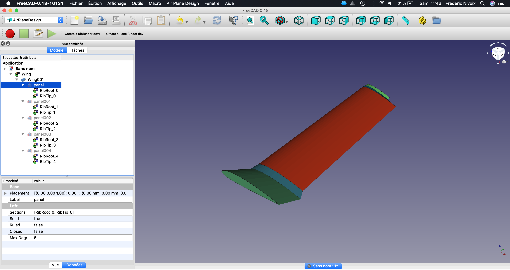
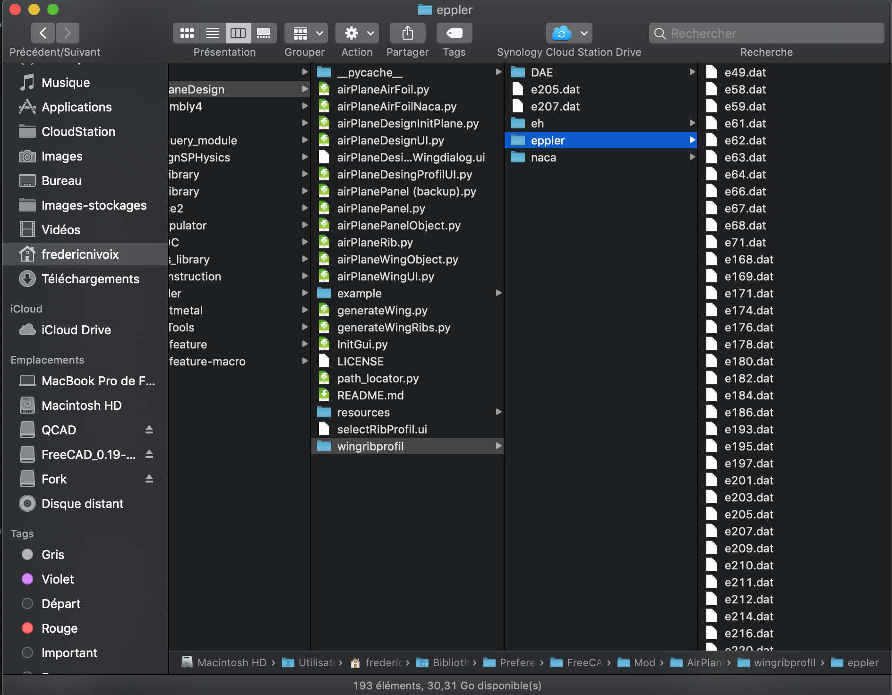
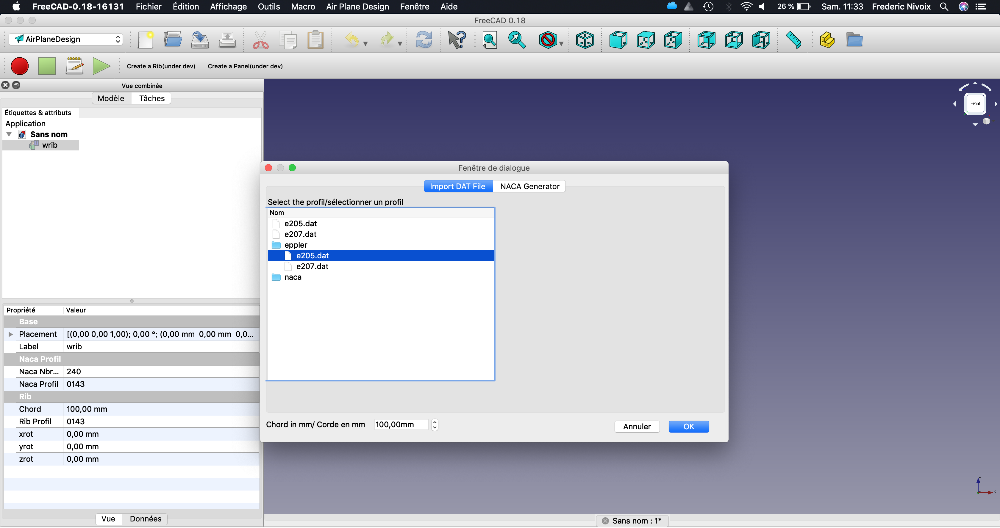

# The FreeCAD Airplane Design Workbench

A FreeCAD workbench dedicated to Airplane Design  

**Warning:** This is highly experimental code. Testers are welcome.

## Release Notes
**v0.3**: NACA Rib generator  
**v0.2**: New release with parametric objects based on a dedicated UI  
**v0.1**: Initial release based on sheet  

**v0.001**: 11 July 2018: Initial version

## Prerequisites
* FreeCAD >= v0.17

## Installation
Use the FreeCAD [Addon Manager](https://github.com/FreeCAD/FreeCAD-addons#installing) to install AirPlaneDesign Workbench.

## Usage
After installation a new menu appears with to function :  
1. Create a rib : you can import DAT file or generate NACA Profil.
1.1 Import a DAT File
Simply copy the DAT File in the folde

1.2 Create a Rib based on a DAT file
In the menu AiplaneDesign select create a RIB, the dialog below appears, clic on the tab "Import DAT File"

Select in the tree the dat file you want to use and define the choord of the rib and clic OK. That's all.
You can change directly in the GUI of the object the Dat File, the Choord (in mm). 

2.Create a wing

Ability to choose the:  
* Profiles you want to import in the UI (.dat format)  
 **Note:** 2 profiles are installed with the workbench ([eppler 205](wingribprofil/e205.dat) and [eppler 207](wingribprofil/e207.dat)). If you'd like to use different profile(s), simply include said .dat file(s) in to the [`wingribprofil`](wingribprofil/) directory.

## Roadmap

- [ ] Add NACA profil generator
- [ ] Improve RIB file selection 
- [ ] Add ability to translate workbench
- [ ] Tutorials

## Feedback
Feedback can be provided via the [discussion thread](https://forum.freecadweb.org/viewtopic.php?f=9&t=38917) on the FreeCAD forums

## License
LGPLv2.1  
See [LICENSE](LICENSE) file
