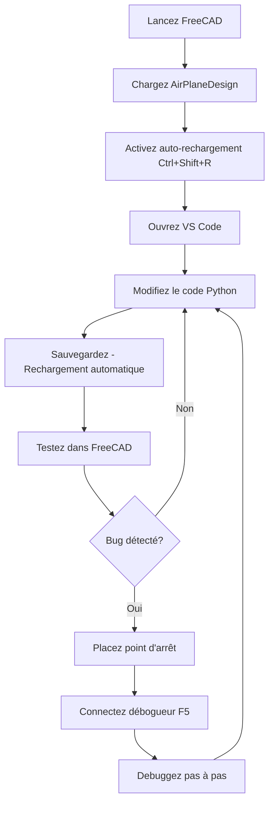

# 🚀 Guide Complet : Débogage et Rechargement FreeCAD

## ✅ Ce qui a été configuré

### 1. Débogage VS Code
- **debugpy** installé et configuré
- **Serveur de débogage** sur le port 5678
- **Configuration VS Code** dans `.vscode/launch.json`
- **Connexion automatique** lors du chargement du workbench

### 2. Rechargement du Workbench
- **Rechargement manuel** via commandes et raccourcis
- **Rechargement automatique** lors des modifications de fichiers
- **Interface utilisateur** avec boutons et menus
- **Module de démonstration** pour tester

## 🛠️ Comment utiliser

### Débogage avec VS Code

1. **Lancez FreeCAD** et chargez le workbench AirPlaneDesign
2. **Vérifiez la console** pour le message :
   ```
   🔧 Serveur de débogage démarré sur le port 5678
   ⏳ En attente de la connexion du débogueur...
   ```
3. **Dans VS Code** :
   - Appuyez sur `F5`
   - Sélectionnez "Attach to FreeCAD"
4. **Placez des points d'arrêt** dans votre code
5. **Exécutez des commandes** dans FreeCAD

### Rechargement du Workbench

#### Méthodes de rechargement manuel :

1. **Console FreeCAD** :
   ```python
   reload_workbench.reload()     # ou
   reload_workbench.rl()        # version courte
   ```

2. **Raccourci clavier** : `Ctrl+R`

3. **Interface graphique** :
   - Bouton "Recharger" dans la toolbar Development
   - Menu Development > Recharger le Workbench

#### Rechargement automatique :

1. **Console FreeCAD** :
   ```python
   reload_workbench.setup_auto_reload()
   ```

2. **Raccourci clavier** : `Ctrl+Shift+R`

3. **Interface graphique** :
   - Bouton "Auto-rechargement" dans la toolbar Development
   - Menu Development > Auto-rechargement

## 🧪 Test et Démonstration

### Test avec le module de démonstration

1. **Ouvrez** `demo_reload.py`
2. **Modifiez** le message dans `demo_function()`
3. **Sauvegardez** le fichier
4. **Rechargez** avec `Ctrl+R`
5. **Observez** le nouveau message dans la console FreeCAD

### Workflow de développement recommandé



## 📋 Raccourcis Clavier

| Raccourci | Action |
|-----------|--------|
| `Ctrl+R` | Recharger le workbench |
| `Ctrl+Shift+R` | Activer l'auto-rechargement |
| `F5` | Connecter le débogueur VS Code |

## 🔧 Commandes Console

| Commande | Description |
|----------|-------------|
| `reload_workbench.reload()` | Rechargement complet |
| `reload_workbench.rl()` | Raccourci pour reload() |
| `reload_workbench.setup_auto_reload()` | Active la surveillance automatique |

## 📂 Fichiers Créés

```
AirPlaneDesign/
├── reload_workbench.py       # Module principal de rechargement
├── reload_commands.py        # Commandes FreeCAD
├── keyboard_shortcuts.py     # Raccourcis clavier
├── demo_reload.py           # Module de démonstration
├── create_reload_icons.py   # Générateur d'icônes
├── install_debugpy.sh       # Installation debugpy
├── DEBUG_GUIDE.md          # Guide de débogage
├── RELOAD_GUIDE.md         # Ce guide
└── resources/icons/
    ├── reload.svg          # Icône rechargement
    └── auto_reload.svg     # Icône auto-rechargement
```

## 🐛 Résolution de Problèmes

### Le rechargement ne fonctionne pas
1. Vérifiez que `reload_workbench.py` est bien importé
2. Regardez les messages d'erreur dans la console FreeCAD
3. Redémarrez FreeCAD si nécessaire

### Auto-rechargement ne détecte pas les modifications
1. Vérifiez que vous modifiez bien des fichiers `.py` dans le dossier du workbench
2. L'auto-rechargement peut prendre 2-3 secondes
3. Vérifiez les permissions de fichiers

### Débogueur VS Code ne se connecte pas
1. Consultez le `DEBUG_GUIDE.md` pour la résolution détaillée
2. Vérifiez que debugpy est installé : `pip list | grep debugpy`
3. Vérifiez que le port 5678 n'est pas utilisé

## 💡 Conseils de Productivité

1. **Activez l'auto-rechargement** au début de chaque session
2. **Utilisez le module de démonstration** pour tester rapidement
3. **Combinez rechargement + débogage** pour un développement efficace
4. **Sauvegardez régulièrement** - l'auto-rechargement se déclenche à la sauvegarde
5. **Utilisez les raccourcis clavier** pour gagner du temps

## 🎯 Prochaines Étapes

1. Testez le rechargement avec vos propres modules
2. Configurez des points d'arrêt dans votre code principal
3. Explorez les fonctionnalités avancées de débogage VS Code
4. Partagez cette configuration avec votre équipe

---

**Bon développement avec FreeCAD ! 🚀**
